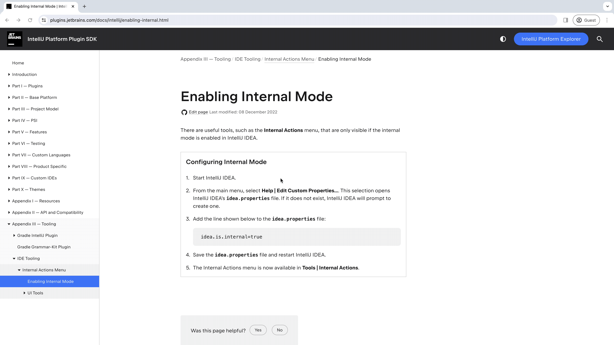

To have access to some internal actions you need to enable `Internal Mode`.
Please, follow steps in internal mode instruction configuration [by this link](https://plugins.jetbrains.com/docs/intellij/enabling-internal.html) and enable it in your IDE.

**Do not forget to restart you IDE after changing idea.properties file!!!**

Also, following gif will show you how Helena done this in her IDE.

