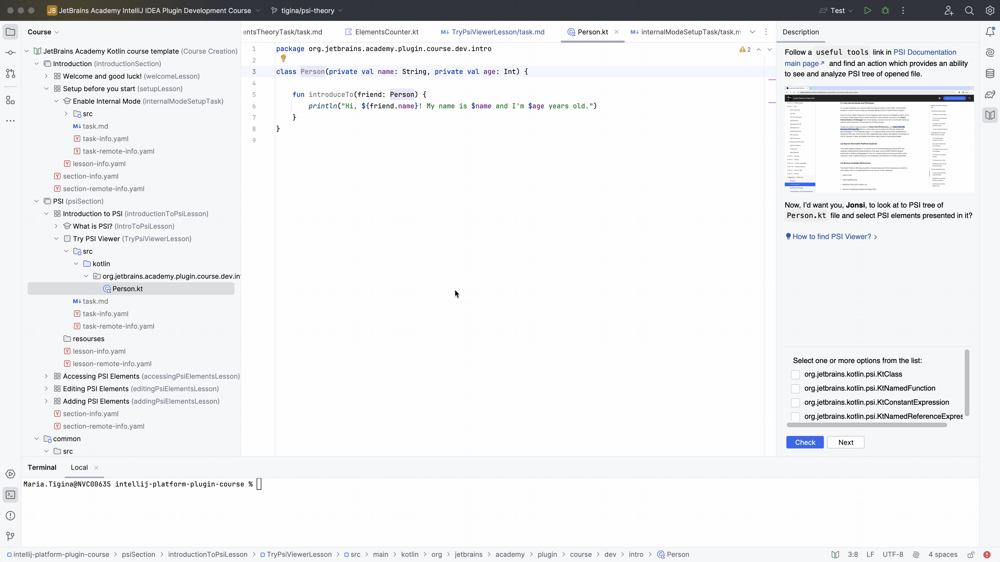

# Task 2/2: PSI Viewer

Follow the `useful tools` link on the [PSI Documentation main page](https://plugins.jetbrains.com/docs/intellij/psi.html)
to find an action that provides the ability to see and analyze the PSI tree of an open file.

Now, I’d like you, **Jonsi**, to look at the PSI tree of the `Person.kt` file
and identify the PSI elements present in it.

Use the `Tools | View PSI Structure of Current File...` action to access the PSI tree.

